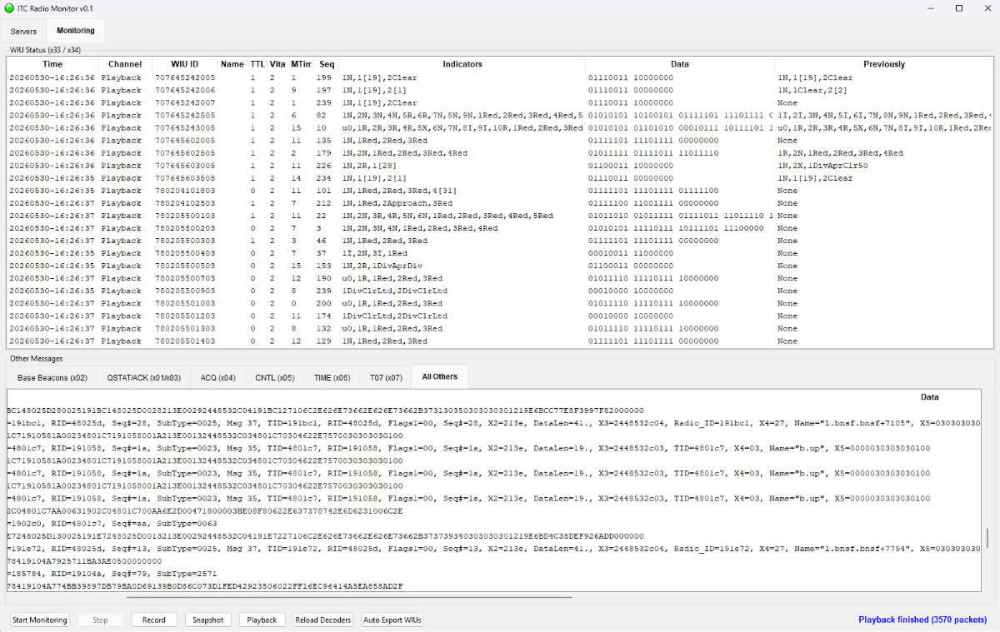
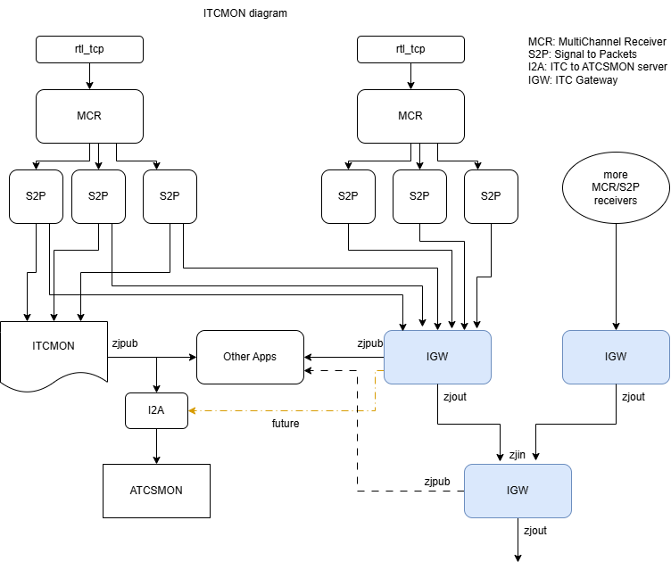

# Interoperable Train Control Monitoring software v0.7

Updates since v0.6:
  - mcr will pick lowest possible sampling rate depending on the range of channels/frequencies configured
  - updates to i2a packets sent to atcsmon
  - new itcdir program is a start on having a directory service to locate public servers for particular wiu's (see src directory)
  - itcmon will stop interpreting and sending indications in a future release, so you will need to use the data field and interpret them yourself if developing an app (can use wiu json data files to do this)

Updates since v0.5:
  - Split the wius.json file up by railroad and next 3 digits of wiu#, so they are now stored in a subdirectory path such as "wius/802/802456.json".  You can run the program "split-wius" to read your old wius.json file and split it up into the right subfiles.   Keep a copy of your wius.json just in case something goes wrong.  However, before running ITCMON delete wius.json or rename it to something else.
  - The auto-export command is replaced with "Save WIUs" which will add any newly discovered ones to your existing files.
  - ITCMON will attempt to decode the signal and switch bits automatically when it discovers new WIUs (based on original idea of Robert Romaine)
  - ITCMON now displays the local time instead of UTC
  - Previous versions had a typo in the frequency for channel 102 and 142, this has been fixed!

Updates since v0.3:
  - greatly improved performance and reception
  - added "-d directory" flag it itcmon to have it read all json files from subdirectory
  - added locomotives display to itcmon
  - new packets.txt format has initial "I" for ITC to allow for future protocols
  - mcr no longer has built-in rtl-sdr driver, it uses rtl_tcp program for reception
  - mcr must be given device number (no longer accepts -1 to find device)
  - mcr has new "-e #" flag to set ppm correction value
  - mcr has new "-q #" flag to set squelch level
  - new igw program for aggregating multiple servers
  - first release of raspberry pi code

Updates since v0.2:
  - added SDR ppm error correction value to mcr.json
  - improved deinterleave and fec code in s2p for better reception
  - added i2a program that translates PTC messages to ATCSMON server messages
  
----------------------------------------------------------------------------
This release runs on Windows (tested on Win 11) and
needs an RTL-SDR, a 220mhz antenna, and the
regular Windows Zadig RTL/USB drivers installed.

Download the ZIP file, unzip it into a new directory, read the files
in the docs directory (start with quick-start.txt)

Please use Groups.IO PTCTalk for discussion of the software and related topics.

The software was built with Cygwin (see cygwin.com for more info).

